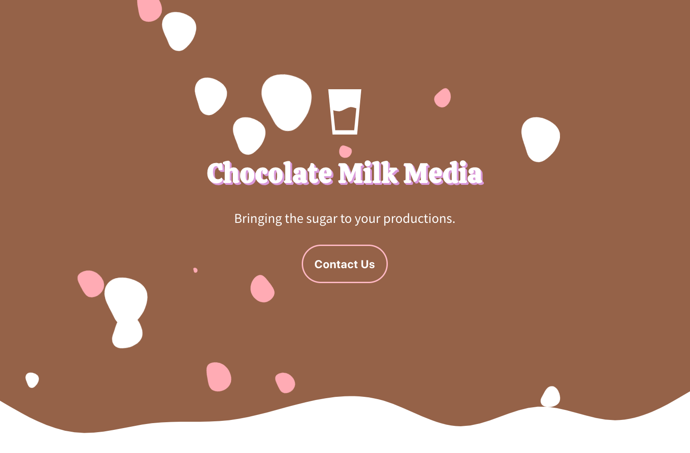

# Chocolate Milk Media

The deployment can be found at [https://chocolatemilkmedia.com/](https://chocolatemilkmedia.com/)

## Design Motivation

I was contacted by a friend of mine starting a new film production company. To help get the word out and have a professional presence on the web, he asked me to build him a website to showcase his experience and showreel. 

I started to research other independent film production companies for inspiration, only to find that they were all outdated or just plain old boring. For this freelance project, I tried to keep the layout fun and vibrant. 

With these goals in mind, I approached the design with these three principals:

* The design should reflect the company's creativity
* It should feel sweet and delicious, like chocolate milk
* It should efficiently and accurately describe the services Chocolate Milk Media can offer to potential clients

## Installation

1) Clone this repository
2) Open `index.html`

## Screenshots

I want the user to form a first impression of Chocolate Milk Media that reflects how hip and creative they can be. I decided on white, pink, and brown as a color scheme. Why? Well, it made me thing of hot chocolate with marshmallows:

After showcasing their projects and crew, I decided to reinforce the 'liquid chocolate' theme by styling most of the elements to look like spilt milk:

## Built With

#### Front-end:

* HTML5
* CSS3
* Javascript
* jQuery

## Deployment

- [Deployment](https://chocolatemilkmedia.com/)

## Authors

* **Daniel DiVenere** -  Development, Deployment, etc - [https://imdan.io/](https://imdan.io/)